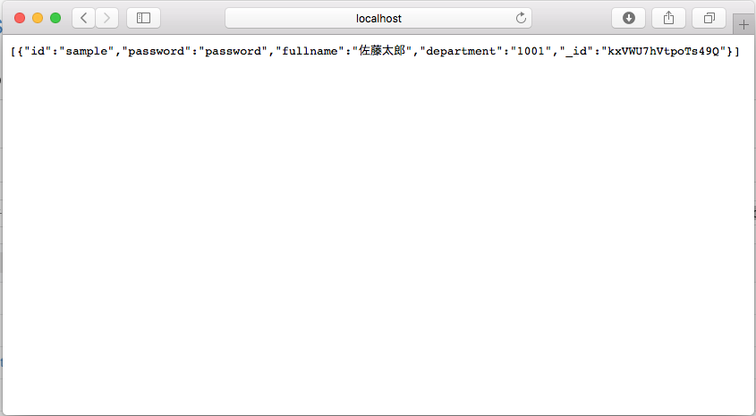
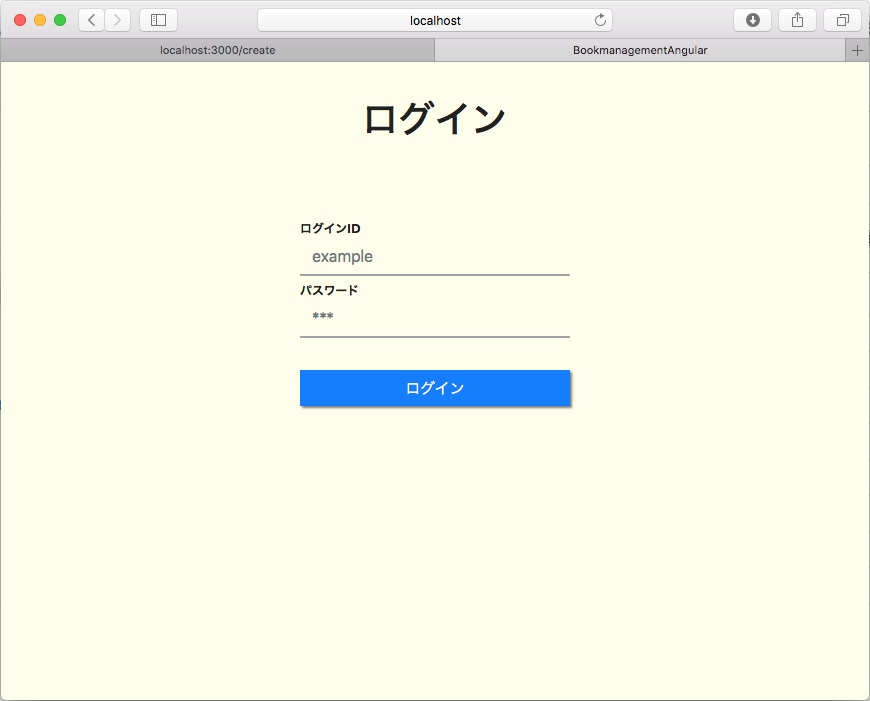

# Angular版 BookManagement

本アプリケーションは、
モダンフロントエンド開発としてのAngularの学習を実施するための学習用アプリケーションです。

## 目的

Angularの基礎的なコーディングを実施する。

- TypeScriptを用いてロジックを記述できる
- Angularのモデルバインディングを行う
- APIをコールし、サーバとのデータのやり取りを行う
    （特に、バックエンドとは完全に分離されることを理解する。）

本講座はAngularによるクライアントサイドの実習であるため、
バックエンドに関するデータベースまわりなどの処理が隠蔽されているということを理解する。

## システム概要

購入した書籍を管理するアプリケーション。

### システム構成

システムとして、クライアントとAPIサーバを用意する。

クライアントからデータベースへのアクセスは実施せず、
すべてAPI経由にてアクセスを行うものとする。

#### クライアント

Angularで動作するアプリケーションを格納・実行する。

URL: http://localhost:4200

### サーバ

Node.jsにて動作するサーバをローカル上で起動する。

URL: http://localhost4300

### 画面一覧

- __ログイン画面__  
    システムへのログインを行う。
- __書籍一覧画面__  
    登録中の書籍一覧を表示する。
- __書籍登録画面__  
    書籍情報の登録を行う。
- __書籍編集画面__  
    書籍の情報を編集する。
- __書籍詳細画面__  
    書籍の情報を表示する。

<div style="page-break-before:always"></div>

## 課題一覧

### 問１：書籍の一覧処理の実装

すでに存在する画面に対し、Angularのループ変数を用いてリストを表示する。

#### 編集ファイル

- src/app/list/list.component.ts
- src/app/list/list.component.html

### 問２：詳細画面の実装

情報の画面表示を行う。
特に価格などのフォーマットがしっかり出来ているかに注力すること。

#### 編集ファイル

- src/app/detail/detail.component.html

### 問３：編集画面の実装

すでに存在する登録画面と詳細画面を参考に編集画面を実装する。
なお、実装する項目は以下の通り

- 既存データの取得
- リストに表示するデータの取得
- クライアントサイドバリデーション
- 保存処理(HTTP通信)

#### 編集ファイル

- src/app/edit/edit.component.html
- src/app/edit/edit.component.ts

## API仕様書

実装を行う際のAPI仕様書を以下に公開しています。
以下の仕様書を元に実装を行って下さい。

[API仕様書](https://bookmanagementapi.docs.apiary.io/#reference)

<div style="page-break-before:always"></div>

## 開発準備

以下の手順に則って準備を行います。
なお、既に以下のソフトウェアがインストールされているものとします。

- node.js / npm
- angular-cli
- Visual Studio Code
- Git

また、実習に使用するOSは以下のいずれかとします。

- Linux (Ubuntuなど)
- Windows 7 / 8.1 / 10
- MacOS 10.13以降

angular-cliが未インストールの場合、下記のコマンドでインストールできます。

```
$ npm install -g @angular/cli
```

### サーバ環境の準備

#### ソースコードのクローン

ターミナル(コマンドプロンプトまたはPowerShell)を起動します。

適当なディレクトリへ移動し、以下のコマンドを実行します。

```shellscript
$ git clone https://github.com/jsn-developer/bookmanagement-api-server.git
```

#### サーバの実行

以下のコマンドを実行し、必要なライブラリをインストールします。

```shell
$ cd bookmanagement-api-server
$ npm install
```

すると、必要なライブラリを取得してインストールされます。

次に、以下のコマンドを実行するとサーバが起動します。

```shell
$ mpm start
```

以下のメッセージが表示されれば、起動は完了です

```shell
initialize datababse.
```

最後に、ブラウザを起動し、http://localhost4300/create にアクセスします。

以下のようなメッセージが表示されればサーバの準備は完了です。



<div style="page-break-before:always"></div>

### クライアント開発の準備

#### ソースコードのクローン

先ほどとは別画面でターミナルを起動し、
同様に任意のディレクトリへ移動します。

以下のコマンドを実行し、学習用のプロジェクトをクローンします

```shell
$ git clone https://github.com/jsn-developer/bookmanagement-angular-study.git bookmanagement-angular
```

#### 学習の準備

以下のコマンドを実行します。

```shell
$ cd bookmanagement-angular
$ npm install
```

サーバの準備時同様に、インストールが完了するまで待ちます。

インストールが完了したら、以下のコマンドを実行します。

```shell
$ code .
```

Visual Studio Codeが起動しますので、

表示 > 統合ターミナル　を選択します。
すると、ターミナルが起動しますので、下記のコマンドを実行します。

```shell
$ ng serve
```

最後に、ブラウザを起動し、 http://localhost:4200　へアクセスします。



以下の情報を入力し、ログインに成功すれば準備は完了です。

|ログインID|パスワード|
|---|---|
|sample|password|
